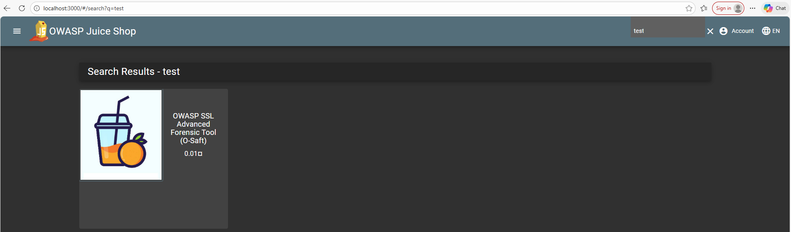
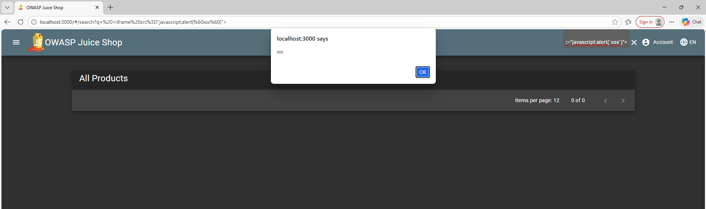
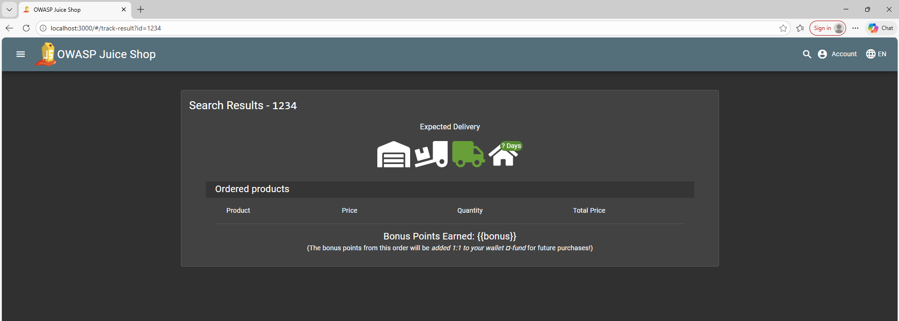
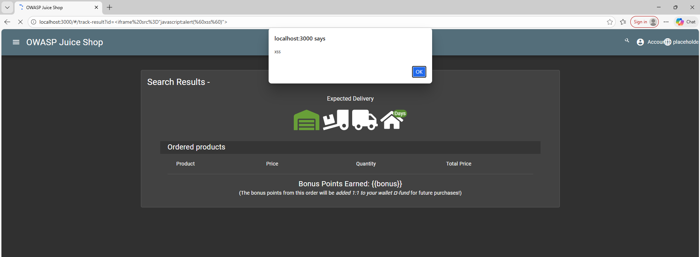
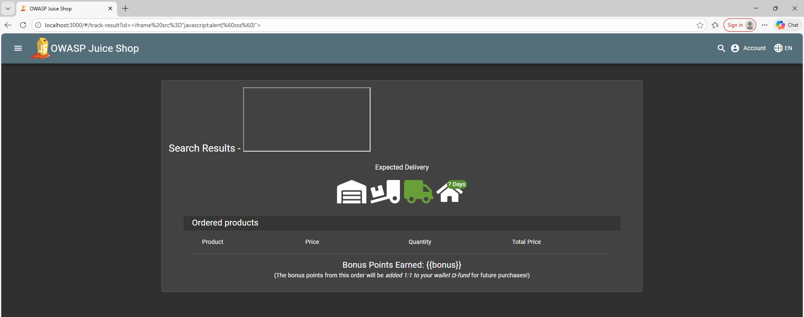

**Name:** Lucas Lorenzo Jakin

**Course:** CyberSecurity Lab

**ID:** IN2300003

 

# OWASP Juice Shop: DOM and Reflected XSS

## 1. Introduction

This report documents the identification, exploitation, and technical analysis of two distinct Cross-Site Scripting (XSS) vulnerabilities within the OWASP Juice Shop application: **DOM-based XSS** and **Reflected XSS**.

Cross-Site Scripting (XSS) is a vulnerability that allows attackers to execute arbitrary JavaScript in the victim's browser. The goal of this assessment was to execute a specific Proof of Concept payload `<iframe src="javascript:alert(xss)>` in two different contexts to understand how data entry points and application logic affect exploitability.

### 1.1 Tools
  
  - OWASP Juice Shop (v19.0.0)
  - Running from docker image
      - `docker run --rm -p 3000:3000 -e "NODE_ENV=unsafe" bkimminich/juice-shop`

 

## 2. Exploitation: DOM XSS

**Vulnerability type:** DOM-based Cross-Site Scripting

**Target location:** Main Navigation Bar (Product search)

The vulnerability exists in the application's search functionality, where user input is rendered directly into the page DOM without sufficient sanitization.

### 2.1 Assumptions

  - The application has a "Product Search" feature. According to standard usability practices, after a user performs a search, the results page should confirm the query with a message like "You search for: `input_value`".
  
  - If the application takes this input and renders it directly into the HTML without sanitizing special characters like `<` and `>`, it might be possible to inject executable HTML tags.

### 2.2 Exploitation steps

  1. **Navigate to the application:** Open the Juice Shop homepage (`http://localhost:3000`).
  2. **Locate the input vector:** Click the **Search Icon** in the top-right navigation bar to reveal the text input field.
  
      - The main search bar is the most obvious candidate for an **input field that updates the page**.
      
      - Test it with some `<h1>` input. If it is rendered in the page, then injection is possible.
  
  3. **Construct the Payload:** The challenge requires a **specific payload with a specific structure** using backsticks ( `) in order to pass the automated verification check.
      
      - **Payload:** `<iframe src="javascript:alert(xss)">`
      
      - `<script>` tags fail in SPAs because `innerHTML` does **not execute scripts after the page load**.
    
  4. **Inject & Execute:** Paste the payload into the search bar and press Enter.
  5. **Result:** The application processes the input client-side and immediately renders the `iframe`. An **alert box** appears displaying "xss".

 

## 3. Exploitation: Reflected XSS

**Vulnerability type:** Reflected Cross-Site Scripting

**Target location:** Order Tracking Page

This vulnerability allows an attacker to inject malicious scripts via the URL parameters. The application reads these parameters and **reflects** them into the page content.

### 3.1 Assumptions

  - For an XSS attack to be "Reflected", the **payload must be part of the request** so that it can be shared with a victim (usually the URL). I need to find a page that reads data from the URL and displays it.
    
  - The **"Track Order"** page likely takes an Order ID as a parameter to know which order to display. If I can manipulate the ID in the URL, the application might display the manipulated ID on the screen.

### 3.2 Exploitation steps

  1. **Navigate to Vulnerable Endpoint:** Navigate directly by changing the URL into `http://localhost:3000/#/track-result`.
  
      - The "Track Orders" page stood out because functionality like this typically relies on a unique identifier passed in the URL to retrieve data.
  
  2. **Identify the parameter:** Observe that the page utilizes an `id` query parameter (e.g., `?id=123`).
  
      - When tracking an order with a specified `id=test`, then the URL changes to `.../track-result?id=test`. This confirms the `id` parameter controls the view.
  
  3. **Construct the Malicious URL:** Append the query parameter containing the XSS payload to the base of the URL.
  
      - **Payload:** `<iframe src="javascript:alert(xss)">`
      
      - **Full URL:** `http://localhost:3000/#/track-result?id=<iframe src="javascript:alert(xss)">`
  
  4. **Trigger the Exploit:** 
  
      - Paste the full URL into browser address bar and press Enter.
      
      - If page displays **"Search Results - undefined"**, you must press **F5 (Refresh)**. By doing this the application is forced to re-initialize the component and read the raw parameter from the URL.
      
          - Since it is a **Single Page Application**, changing the URL bar and just pressing Enter doesn't always trigger the code to "re-read" the URL.
  
  5.  **Result:** Upon reloading, the application reads the `id` from the URL, reflects it into the "Search Results" header, and executes the alert. 

 

 

## 4. DOM vs Reflected XSS

### 4.1 Operational Differences

The table below highlights the operational differences observed during the testing phase.

| *Feature* | *DOM XSS* | *Reflected XSS* |
| :--- | :--- | :--- |
| **Input Vector** | **Internal DOM Element:** The user types directly into an input field on the page. | **External URL:** The input is supplied via the query string (`?id=`) in the address bar. |
| **Attack Delivery** | **Non-Trivial:** Requires social engineering to trick a user into typing the payload themselves. | **High Risk:** The payload is self-contained in a link. An attacker can send this link to a victim (Phishing). |
| **User Interaction** | **Active:** Requires typing or pasting. | **Passive:** Requires clicking a link. |
| **Persistence** | **Volatile:** The payload exists only while the user is typing/searching. It disappears on refresh. | **URL-Dependent:** The payload persists as long as the victim remains on the specific malicious URL. |

### 4.2 Source Code Analysis

While both vulnerabilities technically execute on the client side (browser), they differ fundamentally in **how data enters the application memory**.

#### 4.2.1 The Source (The Entry Point)

  - ***DOM XSS (Search Function):***
      
      - **Mechanism:** The application uses an Angular directive to bind the input field directly to a local variable (e.g., `this.searchQuery`).
      
      - As soon as the user types, the data flows from the **DOM Input** &#8594; **JavaScript variable**. The application is "listening" to the keyboard events.
      
      - **Why it's DOM-based:** The code never looks outside the page. It takes what is currently inside the *Document Object Model (the search box)* and uses it immediately.
      
  - ***Reflected XSS (Track Order)***
  
      - **Mechanism:** When the "Track Order" page loads, the code asks the browser what is the current URL.
      
      - The application uses a technique called **URL Subscription**. It specifically looks for the `?id=` part of the web address.
      
      - The data comes from the **Address Bar (URL)**.
      
      - **Why it's Reflected:** Even though the server didn't build the page, the data mimics a reflection. The input starts in the URL, and the code **"echoes"** it onto the screen. 

#### 4.2.2 The Sink (The Similarity)

Despite different entry points, both vulnerabilities converge at the same "Sink".

In both the **Search** code and the **Track Order** code, the developers explicitly disabled the security using the same method:

  - `this.sanitizer.bypassSecurityTrustHtml(value)` &#8594; *"Trust this HTML. Do not check it for viruses or scripts"*
      
 
      
## 5. Conclusion

This assessment confirms that OWASP Juice Shop is vulnerable to both **DOM-based** and **Reflected XSS**. While both vulnerabilities come from the same root cause they present different risk profiles.

The Reflected XSS (Order Tracker) is considered higher severity because it can be weaponized via a **single malicious link (phishing)**, whereas the DOM XSS (Search Bar) requires **active user input**. Remediation requires removing the manual security bypass in the source code to allow Angular's default data sanitization to function.  

