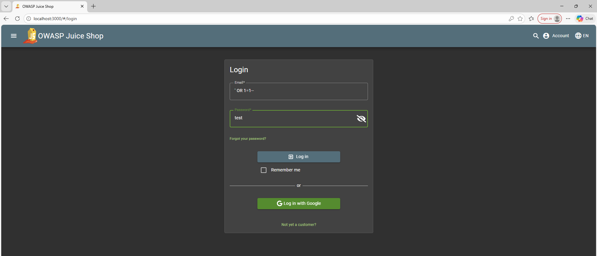
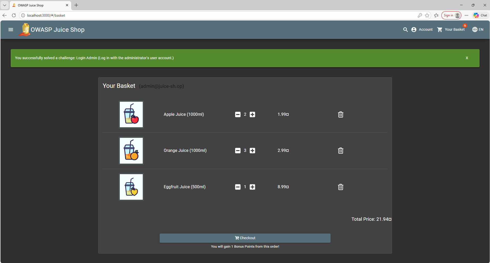
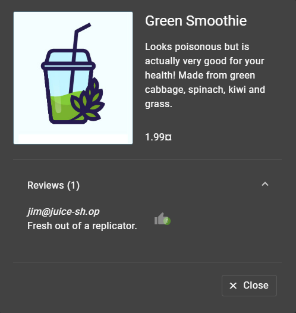
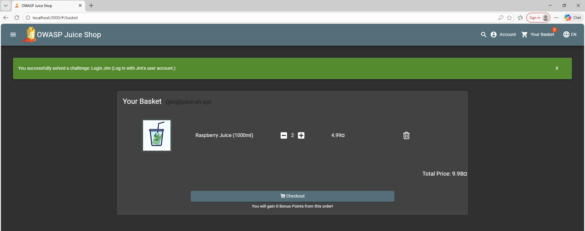
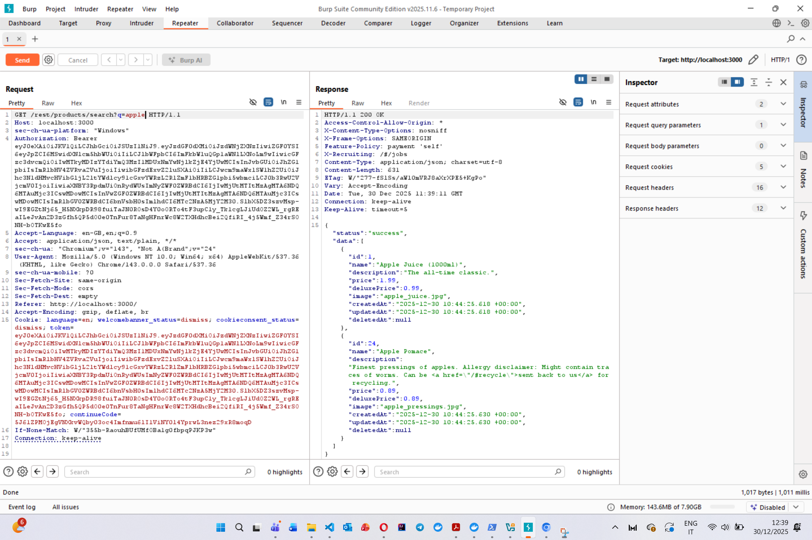
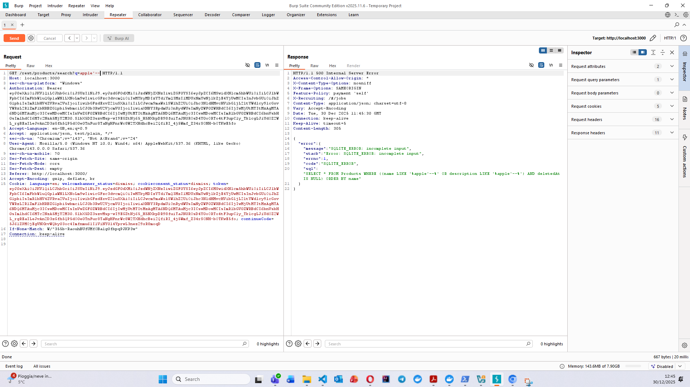
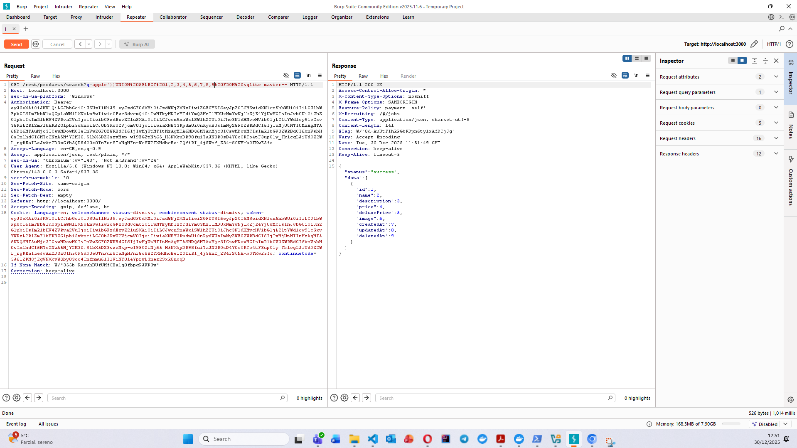
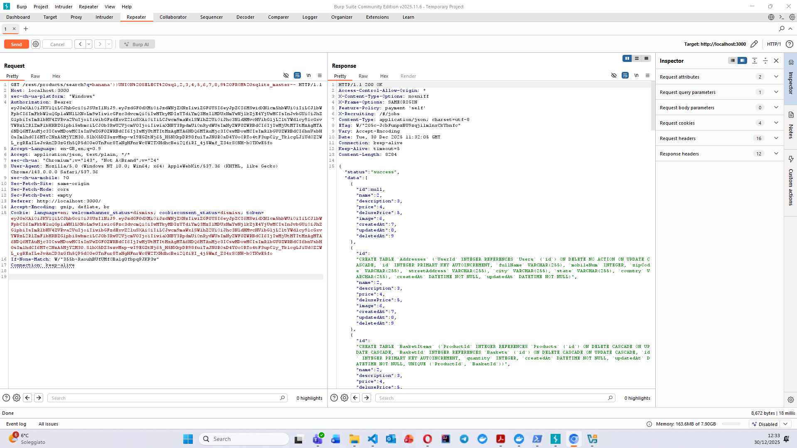

**Name:** Lucas Lorenzo Jakin

**Course:** CyberSecurity Lab

**ID:** IN2300003

 

# OWASP Juice Shop: SQL Injection

## 1. Introduction

This report documents the identification and exploitation of **SQL Injection (SQLi)** vulnerabilities within the OWASP Juice Shop application, focusing on **Authentication Bypass** and **Data Extraction**. 

SQL Injection is a vulnerability that allows attackers to interfere with database queries by injecting malicious input. The goal of this assessment was to illustrate how these vulnerabilities can be exploited to undermine application security across three specific scenarios:

  - **Authentication Bypass:** Gaining unauthorized access to user accounts without credentials, targeting both the default Administrator (**Login Admin**) and a specific user (**Login Jim**).
  
  - **Data Extraction:** Exfiltrating the backend database structure by retrieving the full table definitions (**Database Schema**).
  
### 1.1 Tools

  - OWASP Juice Shop (v19.0.0)
  - Running from docker image
      - `docker run --rm -p 3000:3000 -e "NODE_ENV=unsafe" bkimminich/juice-shop`
  - Burp Suite Community Edition (v2025.11.6)
  
 

## 2. Authentication Bypass

### 2.1 "Login Admin" Challenge

**Vulnerability type:** SQL Injection

**Target location:** `/login` page

**Goal:** Log in as Administrator without a password.

#### 2.1.1 Scenario Analysis

  - In the Juice Shop we can find a standard Log In form that requires an **Email** and a **Password**. We definitely don't know the credentials for the administrator.
  
  - We might assume that the backend uses a **SQL database** and constructs the login query by concatenating the user input directly into a string. A backend query should look like this:
  
      -  `SELECT * FROM Users WHERE email = '[User_Input]' AND password = '[User_Input]';`
  
  
  - If we can Inject an **always true condition (`1=1`)** and ignore the password check, the database should return the first user record found. In almost all databases, the first user created is the **Administrator**
  

 

#### 2.1.2 Exploitation steps

  1. **Navigate to the Target:** Go to *Account* &#8594;*Login*
  
  2. **Craft the Payload:** We need a payload that closes the email field, adds a "True" condition, and removes the rest of the query:
      - `' OR 1=1--`
  
  3. **Inject the Payload:**
  
      - **Email Field:** `' OR 1=1--`
      
      - **Password Field:** Any random characters
  
  4. **Execution:** Click the **Log in** button.
  

 

#### 2.1.3 Result

The resulting query that was executed is this: 
  
  - `SELECT * FROM Users WHERE email = '' OR 1=1--' AND password = 'test';`
  
  - `email = ''`: This is false since no user would have a blank email.
  
  - `OR 1=1`: This is **Always True**.
  
  - `--`: These are the command characters and tells the database to **ignore everything after this point**, so the password check.
  
The application logic simply logs in the **first user** returned by the database, which happens to be the Administrator (`admin@juice-sh.op`).
  
 

### 2.2 "Login Jim" Challenge

**Vulnerability type:** SQL Injection

**Target location:** `/login` page

**Goal:** Log in as a specific user ("Jim") without a password.

#### 2.2.1 Scenario Analysis

  - In the previous challenge we successfully logged in as Admin, but now we want to log in as a **specific user** named Jim.
  
  - We cannot use the same payload as before, because it would return the first user. It would never return Jim because he is further down the list.
  
  - We must tell the database **which user we want to be** and so we must find Jim's unique identifier (his email).

 
  
#### 2.2.2 Reconnaissance

  1. **Search for Clues:** Browse the product catalog for user activity.
  
  2. **Locate Information:** Look at the *"Green Smoothie"* product.
  
  3. **Discovery:** Expand the *"Reviews"* section. There is a review left by a user named "Jim".
  
  4. **Extraction:** The review displays his email address: `jim@juice-sh.op`.
  

 

#### 2.2.3 Exploitation steps

  1. **Navigate to the Target:** Go to *Account* &#8594;*Login*
  
  2. **Craft the Payload:** We want the query to match only Jim's email and to ignore the password check:
      - `jim@juice-sh.op'--`
      
  3. **Inject the Payload:**
  
      - **Email field:** `jim@juice-sh.op'--`
      
      - **Password field:** Any random characters
  
  4. **Execute:** Click the **Log in** button.

 

#### 2.2.4 Result

The resulting query that was executed is this: 
  
  - `SELECT * FROM Users WHERE email = 'jim@juice-sh.op'--' AND password = 'test';`
  
  - `email = 'jim@juice-sh.op'`: The database looks for this **specific email string**. Since Jim exists, this condition is True.
  
  - `--`: The comment characters successfully **removed the password check**.
  
By explicitly defining the target email, we force the query to match exactly one record. The application logic receives this **specific user** object and initiates a session under **Jim's identity.**
  
 

 

## 3. Data Extraction

### 3.1 "Database Schema" Challenge

**Vulnerability type:** SQL Injection

**Target location:** `/rest/products/search?q=` page

**Goal:** Exfiltrate the full backend database structure (schema) to identify table names and column definitions.

#### 3.1.1 Scenario Analysis

  - **Goal:** We need to dump the entire database definition to understand the table structures.
  
  - The **product search function** likely communicates with a beckend database. If the input is **not sanitized**, then we can inject SQL commands.
  
  - **Tools:** Unlike the previous challenges, here we use **Burp Suite** to intercept the HTTP traffic and we open the application using the **Burp Browser Chromium**. This allows us to see the exact **API requests** and **server errors** that are hidden from the standard UI.

 

#### 3.1.2 Exploitation steps

 - ***Step 1:***  **Intercept & Analyze Traffic**
    
    1. Open Burp Suite &#8594; *Proxy* &#8594; *HTTP History*
    
    2. In the Juice Shop application open the product list interface, where all the products are shown.
    
    3. In Burp, locate the request: `GET /rest/products/search?q=`.
    
    4. Send this request to the **Burp Repeater** to modify it without using the browser.
    
  - ***Step2: *** **Fuzzing for Errors**
  
    1. In the Repeater, modify the `q` parameter by adding a product like `apple`.
    
        

    2. Now modify the parameter into `q=apple'`. In this case the server responds with a **500 Internal Server Error**, where the error explicitly states: `SQLITE_ERROR`. This confirms that the database is **SQLite**.
    
    3. We must now **balance the query logic** in order to get no errors. Through some trail we can discover that the query requires a closing quote and **two parentheses** to become valid.
    
        - **Payload:** `apple'))--`
        
    
    
     
    
  - ***Step 3: *** **Determining Column Count**
  
    To extract data, we must use the `UNION SELECT` operator. However, "UNION"" requires both queries to have the **exact same number of columns**. We determine this number by brute-forcing:
    
      1. **Trial 1:** `apple')) UNION SELECT 1--` &#8594; *Error*
      
      2. **Trial 2:** `apple')) UNION SELECT 1,2--` &#8594; *Error*
      
      ...
      
      3. **Trial 9:** `apple')) UNION SELECT 1,2,3,4,5,6,7,8,9--` &#8594; ***Success***

      
    The server returns the products "apple" along with a "product" containing the numbers 1 through 9. This confirms the products table has **9 columns**.
    
    
    
 

  - ***Step 4: *** **Extracting the Schema**
  Now that we have the column count, we can replace one of the numbers with a command to read the database structure. In SQLite, the master table `sqlite_master` contains the SQL used to create all the tables (column named `sql`).
  
      1. **Construct Final Payload:** We replace the `1` with `sql` and query the `sqlite_master` table:
      
          - `apple')) UNION SELECT sql, 2, 3, 4, 5, 6, 7, 8, 9 FROM sqlite_master--`
          
          - Note that the **spaces** must be encoded as `%20`.
      
      2. **Execute:** Send the request forward in the Repeater.
      
      3. **Result:** The response contains the full database schema. WE can read the `CREATE TABLE` statements for sensitive tables like `Users`, `BasketItem` and `Challenges`. 

    
    
     

#### 3.1.3 Result

The application failed to parameterize the search input:

  1. **Injection Point:** The input `apple'))` closed the original query: 
      
      - `SELECT * FROM Products WHERE (name LIKE '%apple' OR description LIKE '%apple')`.
      
  2. **Union Operator:** The `UNION` operator appended a second result set containing the contents of the `sqlite_master` table.
  
  3. **Data Exfiltration:** By aligning the 9 columns, the application mapped the **raw SQL schema definitions into the JSON fields** usually reserved for product details (like "Name" or "Description"), returning them to the user.

