**Name:** Lucas Lorenzo Jakin

**Course:** CyberSecurity Lab

**ID:** IN2300003

 

# AITM Lab 1: SSLStrip Attack

## 1. Introduction

This report documents the execution of an **Adversary-in-the-Middle (AitM)** attack, specifically an **SSLStrip attack**, using Burp Suite. The objective was to intercept traffic between a victim and a web server, strip the SSL/TLS encryption, and manipulate the data in transit.

The assessment was conducted in two distinct scenarios to analyze the effectiveness of **HTTP Strict Transport Security (HSTS)** as a countermeasure:

  - **Case A (No HSTS):** Targeting a website (`w3schools.com`) that does not enforce Strict Transport Security, allowing for a successful **downgrade attack**.
  
  - **Case B (HSTS Active):** Targeting a banking website (`intesasanpaolo.com`) that enforces HSTS, analyzing the behavior during a **"protected"** state versus a simulated **"first visit"** (Trust On First Use) scenario.
  
### 1.1 Tools

  - Burp Suite Community Edition (v2025.11.6)
  - Browser (Burp Chromium) configured to proxy through `127.0.0.1:8080`
  - `chrome://net-internals/#hsts` for policy management
  
 

## 2. Configuration & Methodology

To perform the SSLStrip attack, Burp Suite acts as a proxy that forces the victim's browser to communicate over HTTP while maintaining a secure HTTPS connection with the server.

### 2.1 Configuration Steps

The following configurations were applied in Burp Suite **Proxy Settings**:

  1. **Force TLS (Upstream):** *Proxy Listeners* &#8594; *Edit* &#8594; *Request Handling*
  
      - **"Force use of TLS"** was checked.
      
      - This ensures that when Burp receives an unencrypted HTTP request from the user, it upgrades the connection to HTTPS when communicating with the legitimate server.
      
  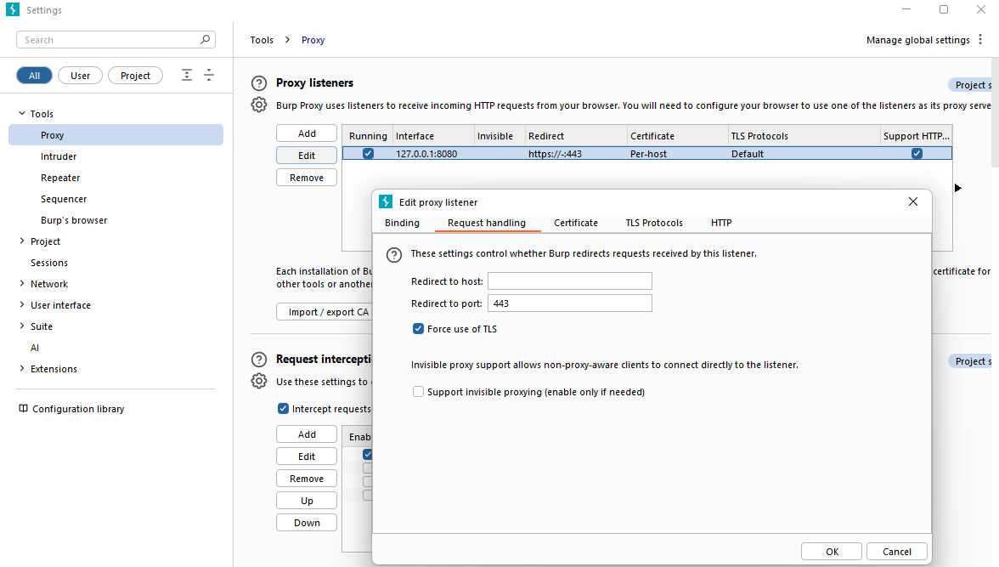

       
    
  2. **Downgrade Links (Response Modification):** 
  
      - Inside *Response Modification Rules*
      
      - **"Convert HTTPS links to HTTP"** was checked.
      
      - This rule rewrites the HTML response from the server. Any link pointing to `https://` is changed to `http://` to prevent the victim's browser from attempting to upgrade the connection.
  
  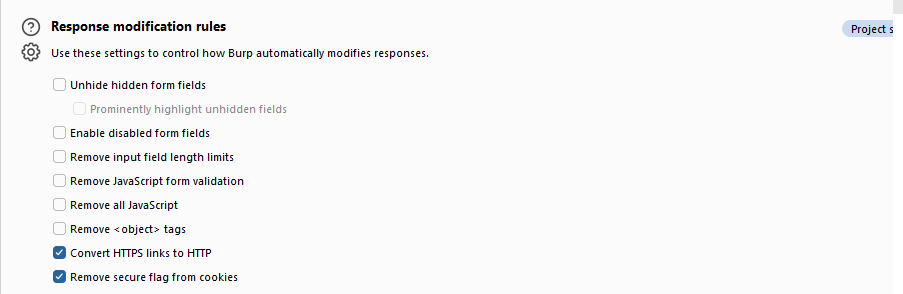

 
  
  3. **Intercept Responses:**
  
      - Inside *Response Interception Rules*
      
      - **"Intercept responses based on the following rules..."** was checked.
      
      - To manually modify the content of the HTML page before it reaches the browser.
  
  
 

### 2.2 Difference from "Normal" Burp Usage

Under normal testing conditions, Burp acts as a compliant intermediary designed to inspect traffic **without modifying the security protocol**. It faithfully mirrors the client's behavior: if the browser requests HTTPS, Burp maintains a secure connection to the server, ensuring the traffic flow remains encrypted as intended.

In this **SSLStrip scenario**, Burp actively **manipulates the protocol**. It intentionally breaks the end-to-end encryption chain by forcing the frontend (Browser &#8594; Burp) to remain **HTTP** while the backend (Burp &#8594; Server) remains **HTTPS**. This is an active attack on the connection logic itself, rather than just analyzing the application logic.

 

## 3. Case A: Non-HSTS Target

### 3.1 Scenario Analysis

**Target:** `www.w3schools.com`

**HSTS Status:** Inactive

Since the target does not send the `Strict-Transport-Security` header, the browser does not remember that this site requires encryption. This makes it vulnerable to an attack where the proxy (Burp) simply rewrites the `https://` redirects to `http://`.

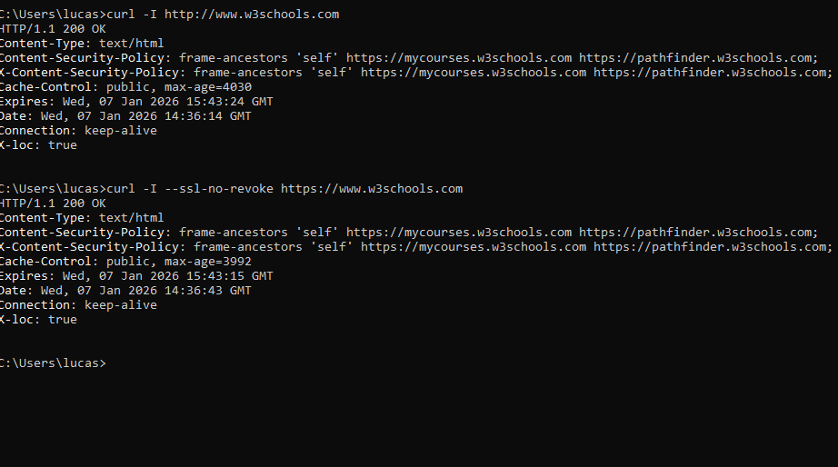

 

### 3.2 Exploitation Steps

  1. **Execution:** In the browser navigate to `http://www.w3schools.com`. Then refresh the website.
  
  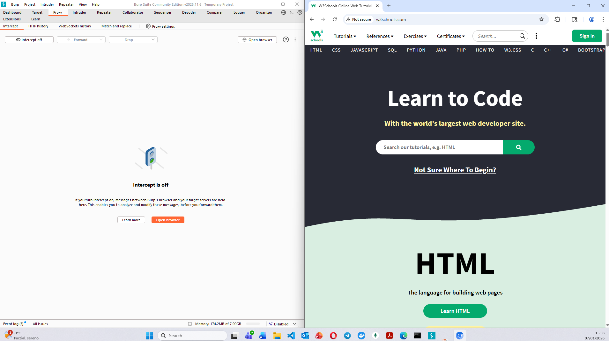
  
   
  
  2. **Interception:** Burp intercepted the request. Due to the configuration, the browser remained on HTTP.
  
  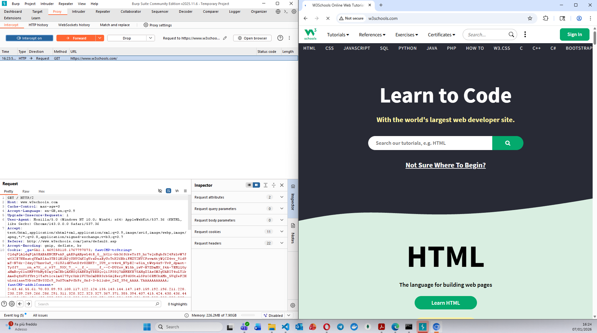
  
   
  
  3. **Modification:** The server response is intercepted. The main heading is modified from "Learn to Code" to "Case A - Cybersecurity DEMO".

  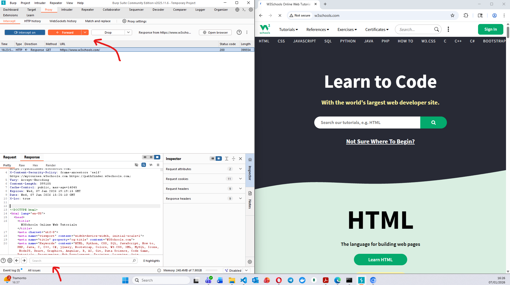
  
   
  
  4. **Verification:** The resulting response is forwarded to the browser.
  
   
  
### 3.2 Result

The attack was successful. The browser displayed the modified content (`Case A - Cybersecurity DEMO`) while the address bar showed an unlocked padlock and the protocol `http://`. The user remained unaware that their connection was not secure.
  
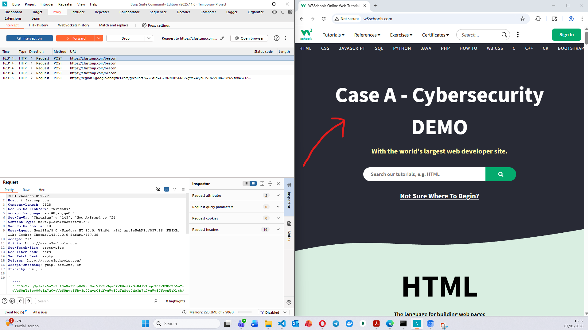

 

## 4. Case B: HSTS Target

### 4.1 Scenario Analysis

**Target:** `intesasanpaolo.com`

**HSTS Status:** Active (Verified via `chrome://net-internals/#hsts`).

This target uses HSTS, a mechanism that tells browsers: **"Never load this site using HTTP; always automatically convert to HTTPS."** This should theoretically prevent the SSLStrip attack. The analysis involved two experiments to test the limits of this protection.

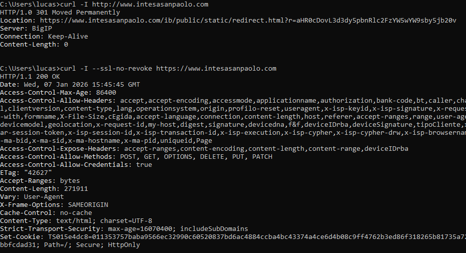

 

### 4.2 Experiment 1: Protected State (HSTS Active)

To simulate a user who has visited the bank before, the domain was manually added to the browser's HSTS set.

  1. **Setup:** In `chrome://net-internals/#hsts`, intesasanpaolo.com was added with "Include subdomains" enabled.

  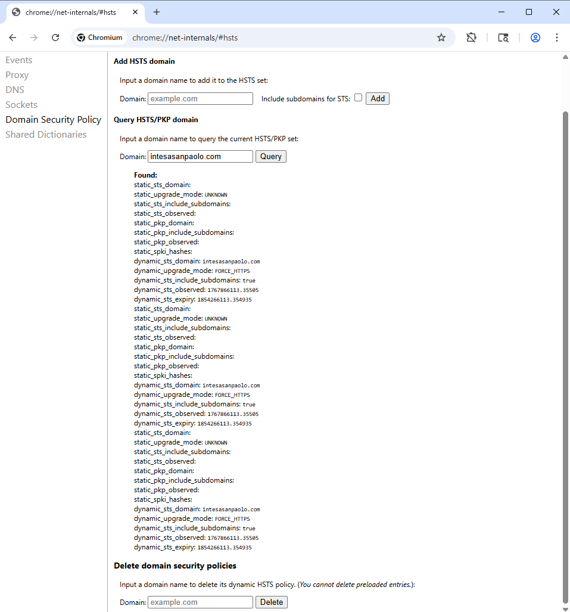

   
  
  2. **Attack Attempt:** In the browser navigate to `http://www.intesasanpaolo.com`. Then refresh the website.
  
  3. **Outcome:** The attack ***failed***. The browser ignored the Burp proxy's attempt to keep the connection on HTTP and immediately forced an **internal redirect to HTTPS**.
  
  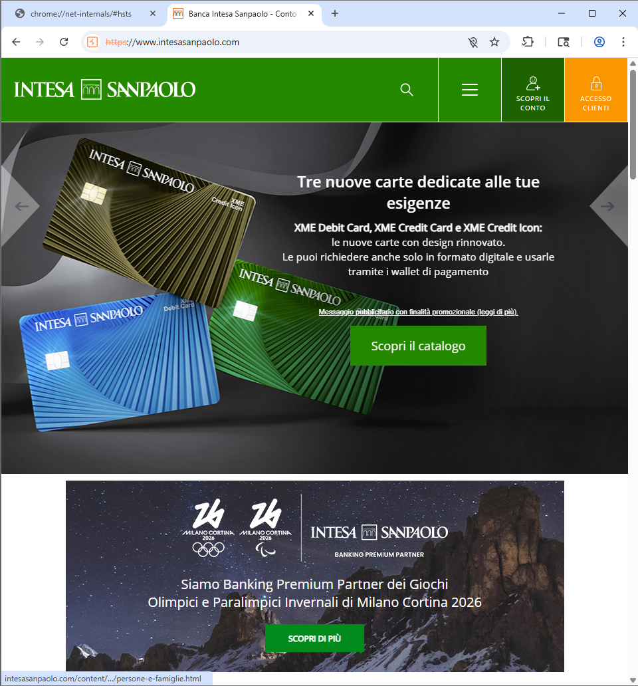

   
  
### 4.3 Experiment 2: Vulnerable State (First Visit)

To simulate a **"First Visit"** scenario (where the browser has not yet seen the HSTS header), the domain was deleted from the HSTS set. This exploits the **Trust On First Use (TOFU) window**.

  1. **Setup:** `intesasanpaolo.com` is deleted from the HSTS set in `chrome://net-internals`. Browser cache is also cleared to remove cached redirects.
  
  2. **Attack Attempt:** In the browser navigate to `http://www.intesasanpaolo.com`. Then refresh the website. As shown in the picture below, HTTP is allowed (**"Not Secure"**).
  
  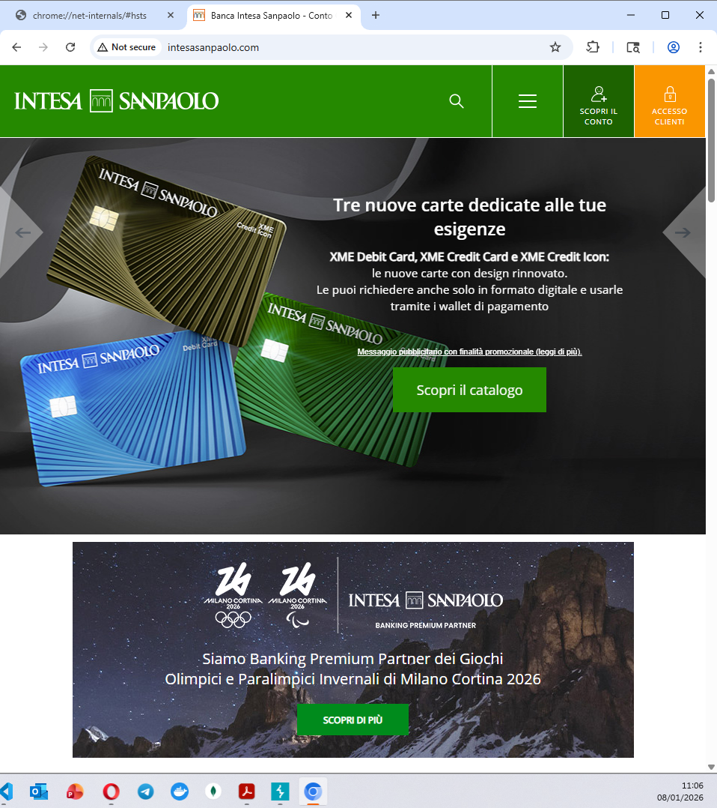
  
   
  
  3. **Interception & Modification:** Since the browser has no memory of the HSTS policy, it allowed the HTTP connection. Burp can successfully intercept the response. The text **"ACCESSO CLIENTI"** gets modified to **"CHANGED BY STUDENT - CYBERSEC"**.
  
  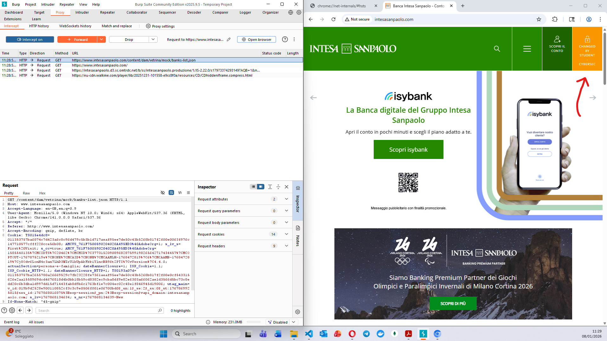
  
   

### 4.4 Result & Discussion

In the second experiment, the attack was ***successful***. The sensitive banking page loaded over HTTP with modified content.

**Conclusion:** HSTS is highly effective for **returning users** (Experiment 1). However, unless the site is Preloaded (hardcoded into the browser's source code), it remains **vulnerable during the very first connection attempt** (Experiment 2). An attacker can strip the SSL headers before the browser ever receives the instruction to become strict.
  
  
  

  
  
  
  