**Name:** Lucas Lorenzo Jakin

**Course:** CyberSecurity Lab

**ID:** IN2300003

 

# AITM Lab 2: ARP Cache Poisoning Attack

## 1. Introduction

This report documents the identification and exploitation of **ARP Cache Poisoning** vulnerabilities within a virtual network environment using **SEED Labs containers**.

The **Address Resolution Protocol (ARP)** is a communication protocol used for discovering the link layer address, such as the MAC address, given an IP address. The ARP protocol is a simple protocol that does not implement security measures. The goal of this assessment was to demonstrate how attackers can fool victims into accepting forged IP-to-MAC mappings, leading to **Man-In-The-Middle (MITM) attacks**.

The assessment covers three specific scenarios:

  - **ARP Cache Poisoning:** Corrupting the ARP cache of victim machines using both ARP Requests and ARP Replies.
  
  - **MITM on Telnet:** Intercepting a Telnet connection between two victims and modifying the communication content.
  
  - **MITM on Netcat:** Intercepting a Netcat chat session and replacing specific sensitive strings (User Name).
  
### 1.1 Tools

  - SEED Labs Ubuntu 20.04 VM
  - Docker Containers already installed in VM (Host A, Host B, Host M)
  - Python3 with Scapy Library
  - Telnet and Netcat utilities
  - Tcpdump/Wireshark
  
 

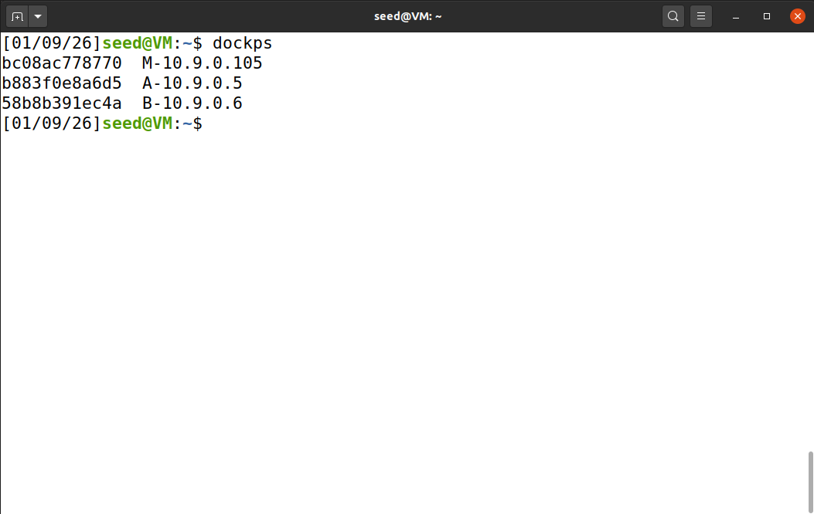

 

## 2. ARP Cache Poisoning

### 2.1 ARP Request Spoofing (Task 1.A)

**Vulnerability type:** ARP Spoofing

**Target location:** Host A (`10.9.0.5`)

**Goal:** Map Host B's IP (`10.9.0.6`) to the Attacker's MAC address in Host A's ARP cache using a forged ARP Request.

#### 2.1.1 Scenario Analysis

  - In a local area network (LAN), when a machine needs to find the MAC address for a specific IP, it **broadcasts an ARP Request**.
  
  - Since ARP is stateless and lacks authentication, a malicious host can broadcast a forged request. If the packet contains the attacker's MAC address mapped to a target IP, the victim receiving the packet will **update its ARP cache with this false information**.
  
  - **Attacker:** Host M (`10.9.0.105`)
  

  
#### 2.1.2 Exploitation steps

  1. **Navigate to Attacker Container:** Access Host M via `docksh`
  
  2. **Craft the payload:** Using Scapy, we construct an ARP Request (`op=1`).
  
      - Source IP: `10.9.0.6` (Host B)
      
      - Source MAC: `02:42:0a:09:00:69` (Attacker M)
      
      - Destination: **Broadcast** (`ff:ff:ff:ff:ff:ff`)
      
      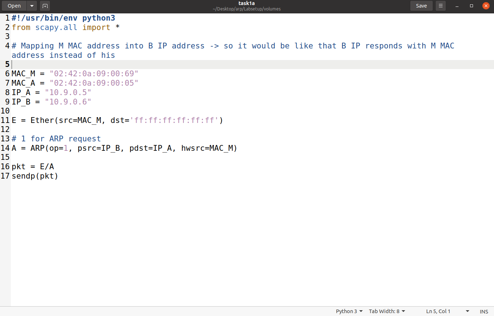
      
 
      
  3. **Inject the Payload:** Run the python script `task1a.py`
  
  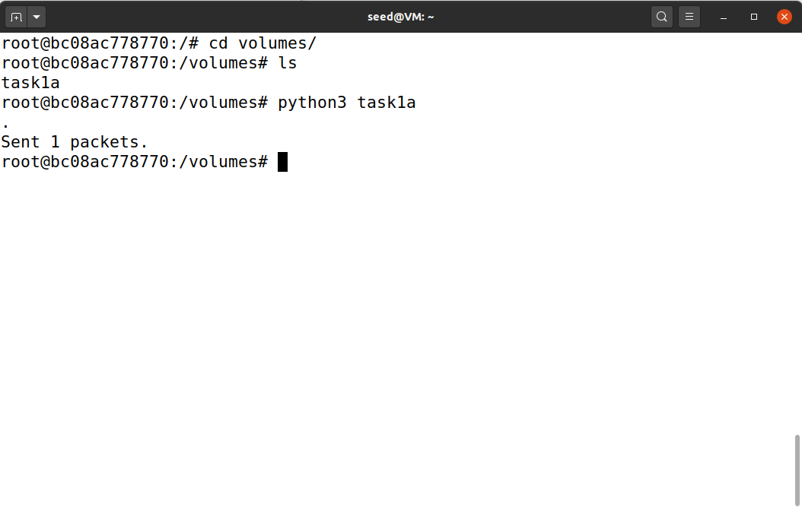
  
   
  
  
  4. **Verification:** On Host A, execute `arp -n` to see the cache.
  
#### 2.1.3 Result

The injection was **successful**. As seen in the figure below, Host A's ARP table was updated. The IP address `10.9.0.6` (Host B) is now mapped to the MAC address ending in `:69` (Attacker M).

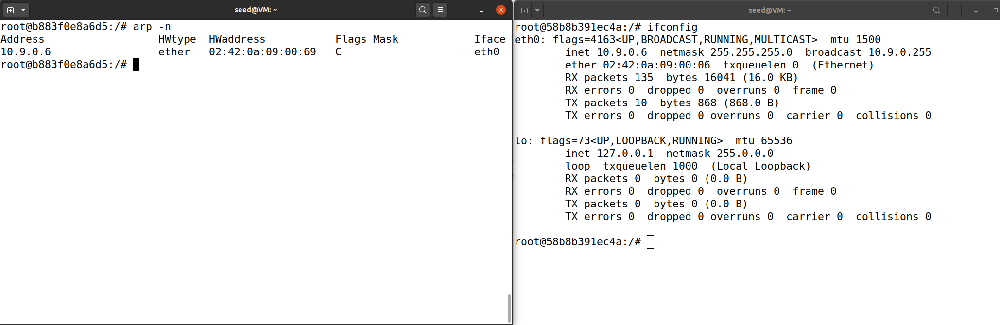

 

### 2.2 ARP Reply Spoofing (Task 1.B)
  
**Vulnerability type:** ARP Spoofing

**Target location:** Host A (`10.9.0.5`)

**Goal:** Map Host B's IP to the Attacker's MAC using an **unsolicited** ARP Reply.

#### 2.2.1 Scenario Analysis

  - Instead of a broadcast request, we use an **ARP Reply** (`op=2`). This acts as an "answer" to a **question that was never asked**.
  
  - Linux operating systems often ignore unsolicited ARP replies **if the IP address is not already present in the cache**. This is a mechanism to reduce cache pollution.
  
  - If Host A has never communicated with Host B, the cache is empty, and the attack fails.
  
  
  
#### 2.2.2 Exploitation steps

  1. **Pre-condition Check:** Run `arp -n` on Host A. If the result is empty, the attack then doesn't work. This can be seen in the figure below, where the cache of A remained empty as before.
  
  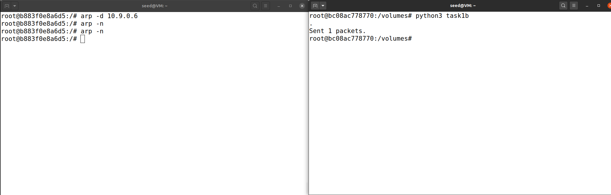
  
   
  
  2. **Populate the Cache:** We force Host A to communicate with Host B.
  
      - Command: `ping 10.9.0.6` on Host A.
      
  3. **Inject the Payload:** Run the python script `task1b.py` on Host M, sending a forged Reply directly to Host A's MAC address.
  
  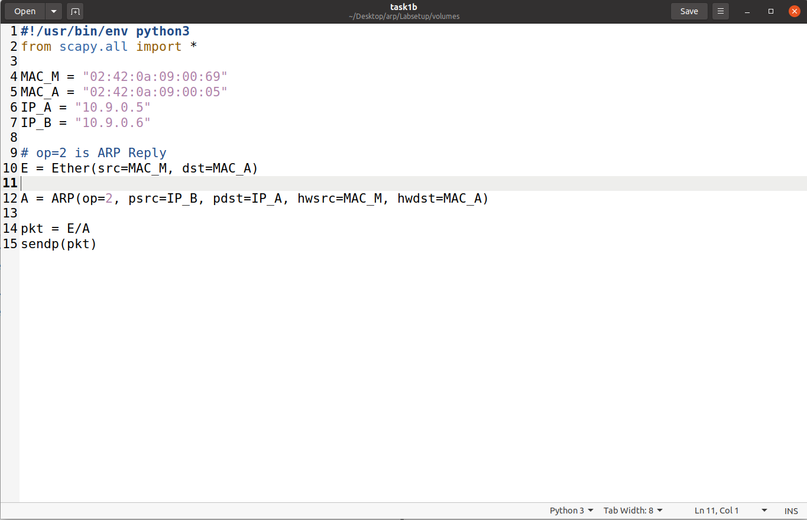

   
  
  4. **Execute:** Check `arp -n` again on Host A.
  
#### 2.2.3 Result

The attack succeeded **only after populating the cache**. The figure below shows that `10.9.0.6` is correctly mapped to the attacker's MAC (`:69`). This confirms that while ARP Reply spoofing is effective, it requires the victim to have a prior relationship with the target IP.

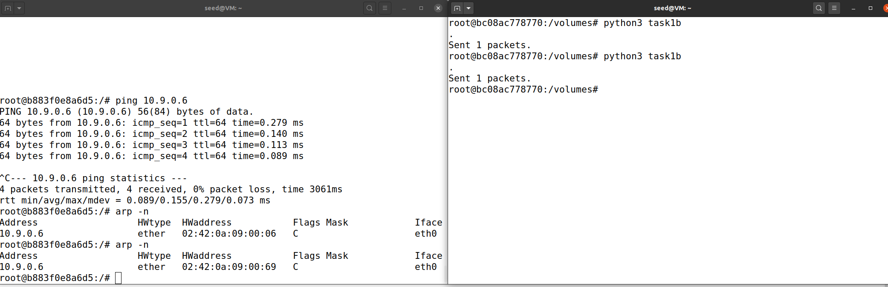

 

### 2.3 ARP Gratuitous Message (Task 1.C)

**Vulnerability type:** ARP Spoofing

**Target:** Broadcast (All hosts on LAN, including Host A)

**Goal:** Map Host B's IP to the Attacker's MAC on Host A using a **Gratuitous ARP packet**.

#### 2.3.1 Scenario Analysis

  - A **Gratuitous ARP** is a special ARP Request packet used by a host to announce its own IP-to-MAC mapping to the entire network.
  
  - **Characteristics:**
  
      - **Source IP** and **Destination IP** are identical (the IP being announced).
      
      - **Destination MAC** is the Broadcast address (`ff:ff:ff:ff:ff:ff`).
      
      - It acts as a **"forced update"** for any machine that already has an entry for that IP
      
  - Unlike in Task 1.B (which targets one victim), a single Gratuitous ARP packet can theoretically "poison" the **cache of every machine on the network** that is currently tracking that IP.
  
  
#### 2.3.2 Exploitation steps

  1. **Scenario 1 (Cache Empty):** The attack was executed while Host A had no entry for Host B.
  
      - **Observation:** The cache remained empty. Similar to the ARP Reply (Task 1.B), Linux ignored the unsolicited update for an unknown IP.
    
      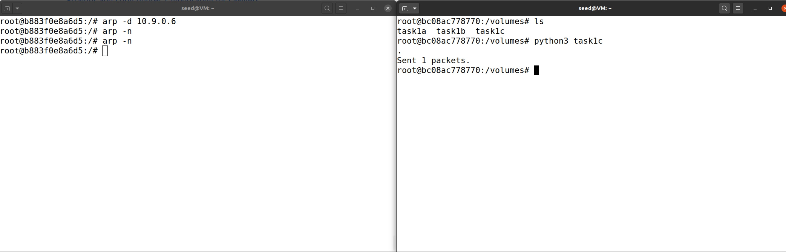

 

  2. **Scenario 2 (Cache Populated):** Host A's cache was populated by pinging to Host B.
  
      - **State:** Host A maps `10.9.0.6` to the real MAC (`:06`).
      
  3. **Inject the Payload:** A Gratuitous packet is constructed in script `task1c.py` using Scapy:
  
      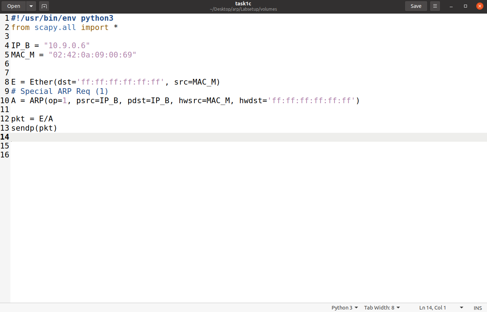
      
   
  
  4. **Verification:** On Host A, execute `arp -n` to see the cache.
  
  
#### 2.3.3 Result

The attack was **successful under Scenario 2**. Once the cache entry existed, Host A accepted the broadcasted Gratuitous ARP and updated the entry for `10.9.0.6` to point to the Attacker's MAC address (`:69`).

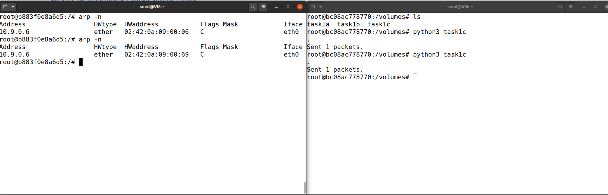

 

## 3. Main-In-The-Middle (MITM) Attack

### 3.1 "Telnet Interception" - *Task 2*

**Vulnerability type:** MITM via ARP Spoofing

**Target location:** Telnet connection between

**Goal:** Intercept the Telnet traffic and replace every user keystroke with the character 'Z'.

#### 3.1.1 Scenario Analysis

  - **Goal:** We want to sit in the **middle of the connection**. Traffic from A &#8594; B must pass through M. Traffic from B &#8594; A must also pass through M.
  
  - **Requirement:** We must "poison"" **both** Host A and Host B simultaneously.
  
  - **Routing:** Initially, the **kernel's IP forwarding** is used to test connectivity. Later, it is **disabled** so our Python script can intercept and modify the packets manually.
  
#### 3.1.2 Exploitation steps

  - ***Step 1: Bidirectional Poisoning***
  
      1. A script `mitm-attack.py`is created to **continuously send forged ARP packets to both victims**.
      
      2. **Host A** is told B is at M's MAC.
      
      3. **Host B** is told A is at M's MAC
      
  
      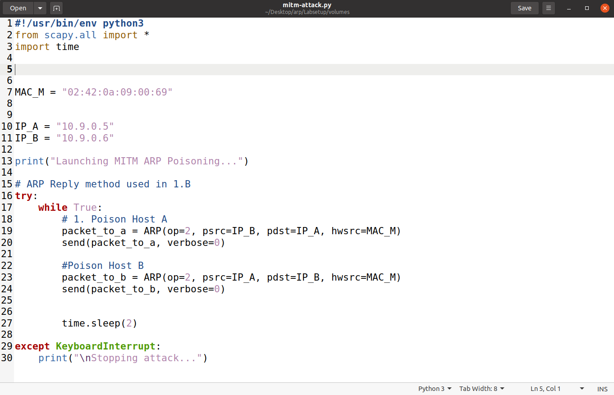
   
  
  - ***Step 2: Testing Forwarding***
  
      1. With `sysctl net.ipv4.ip_forward=0`, pinging between A and B failed. This confirmed **traffic was hitting Host M** and stopping.
      
      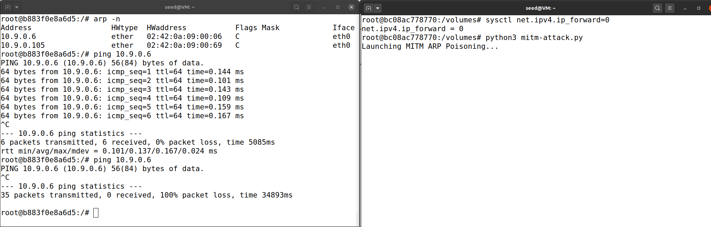
      
       
      
      2. With `sysctl net.ipv4.ip_forward=1`, pinging succeeded. This confirmed Host M was **successfully routing traffic**.
      
      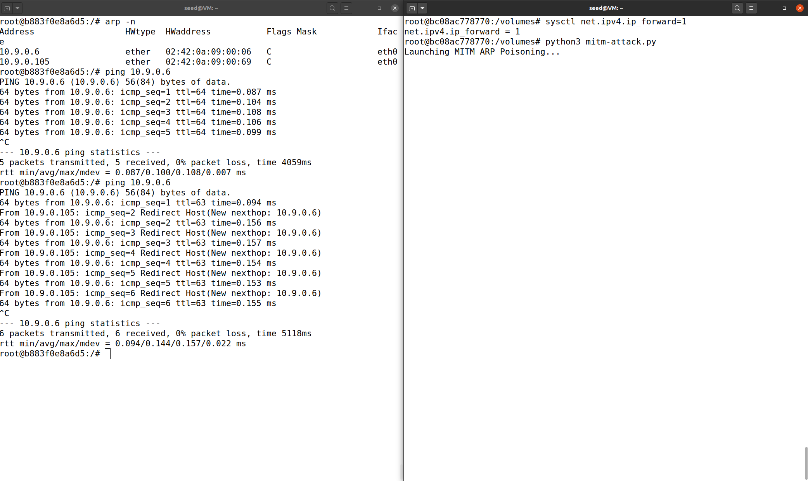
      
       
      
  - ***Step 3: Sniffing and Spoofing***
  
      1. A Telnet connection is established from A to B (`telnet 10.9.0.6`).
      
      2. IP forwarding (`sysctl net.ipv4.ip_forward=0`) is disabled to prevent the kernel from intefering.
      
      3. We have two attacker containers opened in two different terminals. In one the script we have created before (`mitm-attack.py`) is running all the time, in the other we start the execution of another script `sniff_spoof.py` to **capture TCP packets**.
      
      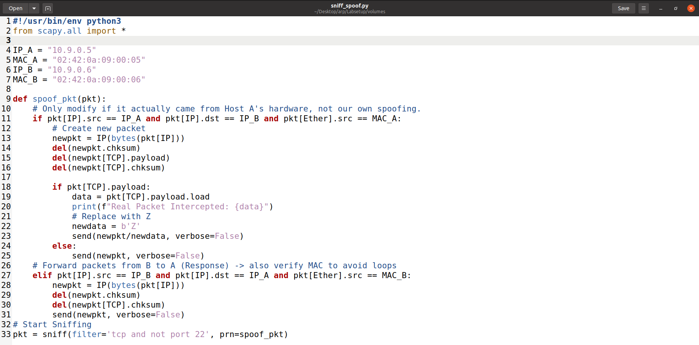

 

#### 3.1.3 Result

As shown in the figure below, the sniffer **successfully intercepted the real keystrokes** that Host A has sent (`b't'`, `b'e'`, `b's'`, `b't'`). The user on Host A saw only `ZZZZ` on their screen, confirming the **integrity of the session was compromised**.

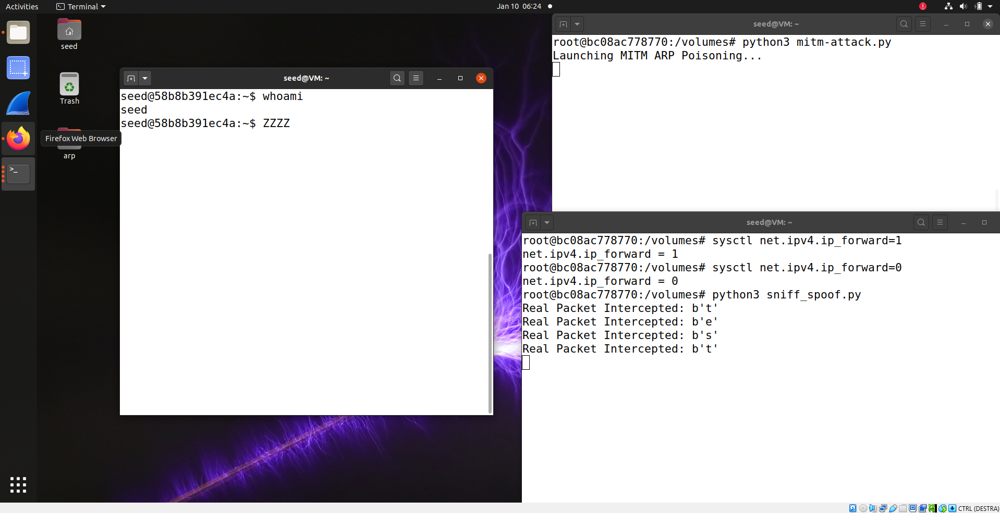

 

### 3.2 "Netcat Name Replacement" - *Task 3*

**Vulnerability type:** MITM via ARP Spoofing

**Target location:** Netcat chat session

**Goal:** Replace the user's first name ("Lucas") with a sequence of A's ("AAAAA").

#### 3.2.1 Scenario Analysis

  - This task uses **Netcat**, which creates a raw TCP stream.
  
  - When modifying TCP payloads, the **length of the new data must usually match the length of the old data**. Changing the length would desynchronize the TCP Sequence numbers, causing the **connection to hang or reset**.
  
  - Therefore, we replaced the name **"Lucas"** (5 chars) with **"AAAAA"** (5 chars).
  

#### 3.2.2 Exploitation steps

  1. **Setup:**
  
      - Server (Host B): `nc -lp 9090`
      
      - Client (Host A): `nc 10.9.0.6 9090`
  
  2. **Code Logic:** A new script `task3_netcat.py` is created from a modified `sniff_spoof.py` in order to search for the string `Lucas` inside the payload.
  
  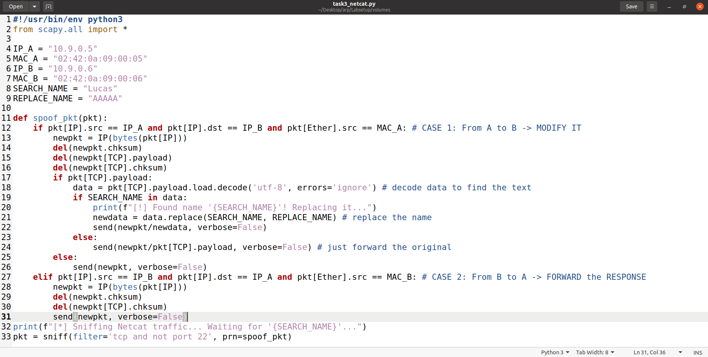
  
   
  
  3. **Execution:**
  
      - On one attacker's terminal there is the script `mitm-attack.py` which is getting executed. 
      
      - IP forwarding (`sysctl net.ipv4.ip_forward=0`) is disabled to prevent the kernel from intefering.
      
      - `task3_netcat.py` is running on another attacker's terminal and the Host A enters the payload: `I am Lucas. Lucas is a cool name`.
      

#### 3.2.3 Result

The packet was **intercepted by Host M**. The script detected the string "Lucas" and replaced it. The message received and displayed on Host B was: `My name is AAAAA. AAAAA is a cool name`.

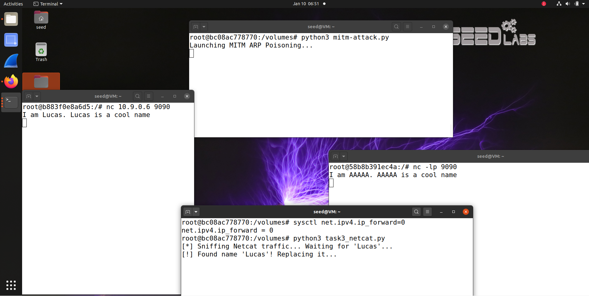

